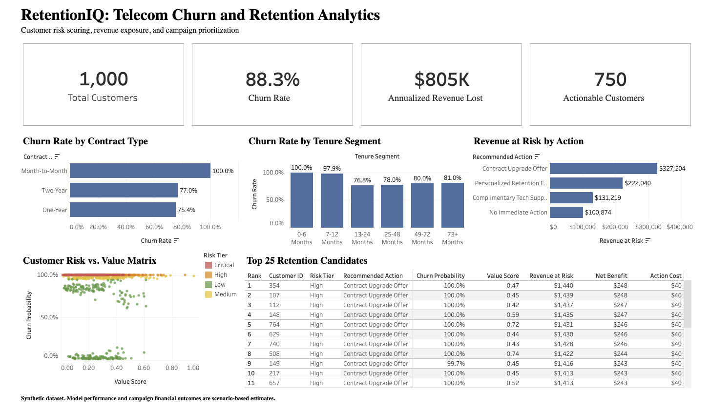

# RetentionIQ: Telecom Churn and Retention Analytics

RetentionIQ is an end-to-end customer retention analytics project that identifies churn risk, estimates revenue exposure, prioritizes high-risk customers, recommends retention actions, and simulates campaign outcomes under different budgets.

## Dashboard



### Live Dashboard

[View the interactive RetentionIQ dashboard on Tableau Public](https://public.tableau.com/views/RetentionIQ_Dashboard_twbx/RetentionIQDashboard?:language=en-US&publish=yes&:sid=&:redirect=auth&:display_count=n&:origin=viz_share_link)

## Business Problem

Telecom retention teams have limited budgets and cannot contact every customer.

This project answers:

- Which customers are most likely to churn?
- Which customers represent the highest revenue risk?
- Which customers should be contacted first?
- What retention action should each customer receive?
- How many customers can be targeted under different campaign budgets?
- What revenue could potentially be protected?

## Project Use Case

Instead of stopping at churn prediction, this project creates a customer retention decision-support system.

Each customer receives:

- Churn probability
- Campaign risk tier
- Customer value score
- Retention priority score
- Annual revenue at risk
- Recommended retention action
- Intervention cost
- Expected revenue protected
- Expected net benefit
- Campaign rank

## Project Workflow

```text
Kaggle dataset
    ↓
Data validation and cleaning
    ↓
Exploratory churn analysis
    ↓
Business-rule benchmarking
    ↓
Logistic regression and random forest
    ↓
Customer risk and value scoring
    ↓
Retention recommendation engine
    ↓
Campaign budget simulation
    ↓
SQLite analytics layer
    ↓
Tableau dashboard
```

## Tools and Technologies

- Python
- pandas
- NumPy
- scikit-learn
- SQLite
- SQL
- Tableau Public
- Jupyter Notebook
- VS Code
- Git
- GitHub

## Dataset

The project uses a synthetic telecom customer churn dataset from Kaggle.

The original dataset contains:

- 1,000 customer records
- 10 columns
- Customer demographics
- Tenure
- Monthly charges
- Contract type
- Internet service
- Total charges
- Tech support
- Churn status

Dataset source:

`abdullah0a/telecom-customer-churn-insights-for-analysis`

## Data Quality Findings

The following checks were completed:

- 1,000 unique customer IDs
- No duplicate rows
- No duplicate customer IDs
- 297 missing `InternetService` values
- Missing `InternetService` values were interpreted as `No Internet`
- `TotalCharges` exactly matched `Tenure × MonthlyCharges`
- 51 customers had zero tenure and zero total charges
- 21 customers had tenure above 72 months
- Two age values were flagged for review
- No rows were removed during cleaning

## Exploratory Analysis Findings

The dataset had an unusually high churn rate of 88.3%.

Key findings:

- 883 customers churned
- 117 customers were retained
- Month-to-month customers had a 100% churn rate
- Customers without tech support had a 100% churn rate
- Customers with no internet service had a 100% churn rate
- Customers with tenure between 0 and 6 months had a 100% churn rate
- Premium-charge customers had a 100% churn rate
- Churned customers had an average monthly charge of $75.96
- Retained customers had an average monthly charge of $62.55
- Churned customers represented approximately $67,073 in monthly revenue
- Churned customers represented approximately $804,880 in annualized revenue

## Synthetic Pattern and Leakage Assessment

The dataset contains highly deterministic churn patterns.

A transparent combined business rule using contract type, tech support, tenure, and monthly charges achieved 96.5% accuracy on the full dataset.

This indicated that machine-learning performance could be inflated by synthetic patterns.

For this reason, model results are treated as portfolio benchmarks rather than production-ready estimates.

## Model Performance

Three approaches were compared:

| Model                  | Accuracy | Precision | Recall | F1 Score | ROC-AUC |
| ---------------------- | -------: | --------: | -----: | -------: | ------: |
| Combined Business Rule |    97.5% |    100.0% |  97.2% |    98.6% |     N/A |
| Logistic Regression    |    93.5% |    100.0% |  92.7% |    96.2% |   99.1% |
| Random Forest          |   100.0% |    100.0% | 100.0% |   100.0% |  100.0% |

Random Forest was selected for customer scoring.

Its perfect test performance is not presented as production-ready because the dataset contains synthetic and highly deterministic churn relationships.

## Customer Segmentation

Customers were segmented using:

- Campaign risk tier
- Customer value tier
- Retention priority tier
- Customer lifecycle stage
- Tenure segment
- Monthly charge band

Campaign risk tiers were created using percentile-based segmentation:

- Critical
- High
- Medium
- Low

This produced balanced campaign groups even though model probabilities were highly polarized.

## Retention Recommendation Engine

The recommendation engine assigns actions using risk, value, contract type, tech support, and tenure.

Recommended actions include:

- Contract Upgrade Offer
- Complimentary Tech Support
- Personalized Retention Email
- No Immediate Action

Final action distribution:

| Recommended Action           | Customers |
| ---------------------------- | --------: |
| Contract Upgrade Offer       |       359 |
| Personalized Retention Email |       250 |
| No Immediate Action          |       250 |
| Complimentary Tech Support   |       141 |

## Campaign Budget Simulation

Only customers with a positive expected net benefit were included as actionable candidates.

A total of 750 customers were identified as actionable.

|  Budget | Customers Targeted | Campaign Cost | Expected Revenue Protected | Expected Net Benefit | Expected ROI |
| ------: | -----------------: | ------------: | -------------------------: | -------------------: | -----------: |
|  $1,000 |                 25 |        $1,000 |                     $7,021 |               $6,021 |         6.02 |
|  $2,500 |                 62 |        $2,480 |                    $16,752 |              $14,272 |         5.75 |
|  $5,000 |                132 |        $5,000 |                    $32,790 |              $27,790 |         5.56 |
| $10,000 |                287 |        $9,980 |                    $61,039 |              $51,059 |         5.12 |
| $15,000 |                436 |       $15,000 |                    $79,942 |              $64,942 |         4.33 |
| $20,000 |                750 |       $17,680 |                    $91,785 |              $74,105 |         4.19 |

Expected ROI decreases as the campaign budget increases because the highest-benefit customers are prioritized first.

## SQL Analytics Layer

The processed datasets were loaded into SQLite.

The database contains four tables:

- `telecom_customers`
- `customer_retention_scores`
- `campaign_candidates`
- `campaign_budget_scenarios`

SQL queries were created for:

- Overall churn KPIs
- Churn by contract type
- Churn by tech support
- Churn by tenure segment
- Revenue at risk by recommended action
- Top retention candidates
- Campaign budget scenarios

The SQL file is available at:

```text
sql/churn_analysis.sql
```

## Tableau Dashboard

The Tableau dashboard includes:

- Total Customers
- Churn Rate
- Annualized Revenue Lost
- Actionable Customers
- Churn Rate by Contract Type
- Churn Rate by Tenure Segment
- Revenue at Risk by Recommended Action
- Customer Risk vs. Value Matrix
- Top 25 Retention Candidates

The packaged workbook is available at:

```text
dashboard/tableau/RetentionIQ_Dashboard.twbx
```

## Repository Structure

```text
retentioniq-telecom-churn/
├── dashboard/
│   └── tableau/
│       └── RetentionIQ_Dashboard.twbx
├── data/
│   ├── raw/
│   └── processed/
├── models/
├── notebooks/
│   └── 01_retentioniq_analysis.ipynb
├── reports/
│   └── figures/
│       └── retentioniq_dashboard.png
├── sql/
│   └── churn_analysis.sql
├── src/
├── download_data.py
├── requirements.txt
└── README.md
```

## How to Run the Project

### 1. Clone the repository

```bash
git clone https://github.com/deardisha/retentioniq-telecom-churn
cd retentioniq-telecom-churn
```

### 2. Create a virtual environment

```bash
python3 -m venv .venv
source .venv/bin/activate
```

### 3. Install dependencies

```bash
pip install -r requirements.txt
```

### 4. Download the dataset

```bash
python download_data.py
```

### 5. Run the notebook

Open:

```text
notebooks/01_retentioniq_analysis.ipynb
```

Select the project virtual environment as the notebook kernel and run all cells.

## Limitations

- The dataset is synthetic
- The churn rate is unusually high
- Several variables create deterministic churn rules
- Random Forest performance is inflated by synthetic patterns
- Campaign success rates are assumptions
- Revenue protection values are scenario estimates
- No historical campaign-response data is available
- The model has not been validated on real production data

## Future Improvements

- Add historical retention campaign outcomes
- Add customer-service interaction data
- Add network-quality and outage data
- Add payment history and billing events
- Use uplift modeling to estimate treatment impact
- Add SHAP-based model explainability
- Deploy the scoring pipeline as an API
- Add automated data validation and model monitoring

## Author

**Disha Goyal**

Data Analyst and Data Engineer

Skills demonstrated:

- Python
- SQL
- Machine learning
- Tableau
- Data cleaning
- Exploratory data analysis
- Customer segmentation
- Business analytics
- Campaign optimization
- Data storytelling
